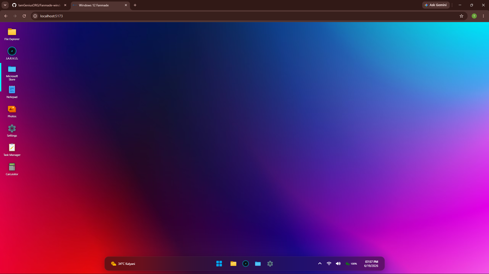

# Fanmade Windows 12 Web OS

Welcome to the Fanmade Windows 12 simulation! This project features a beautiful Windows 12-inspired web desktop environment powered by standard web technologies (HTML/CSS/JS) running on Vite. It is a highly advanced simulation featuring real-world native file system access, dynamic hardware metrics, persistent storage, fluid window management, and an integrated local AI assistant.

## 🚀 Latest Updates



Check out the massive new upgrades to the OS architecture:
- **Hardware-Accelerated Fluid Animations**: Re-engineered the window manager with dynamic `transform-origin` calculations so windows smoothly scale down directly into their taskbar icons when minimized, alongside bouncy open/close scale animations.
- **"Mica" Glassmorphism UI Polish**: A gorgeous, authentic Windows 12 aesthetic using a calculated mix of `backdrop-filter: blur(25px)` and alpha channels allowing desktop wallpaper colors to dynamically bleed through the UI.
- **Live Taskbar Hover Previews**: Integrated a microscopic DOM-cloning engine that silently generates live, scaled-down snapshots of your open apps when you hover over them on the taskbar.
- **Live Resource Monitoring**: The Task Manager is wired to your browser's real performance metrics and uses a custom Node backend plugin to display your host system's exact CPU model, logical processors, and RAM capacity.
- **Persistent Virtual File System (VFS)**: Creates, saves, and retains documents as a JSON tree structure in `localStorage` across page reloads.
- **Native File System Access**: Integrates modern Web APIs (`showOpenFilePicker`) allowing you to natively import and export `.txt` files directly between your real computer and the web OS.
- **Dynamic Z-Index Stacking**: Click or interact with any window, and it immediately snaps to the absolute front of the UI stack, mimicking true desktop multitasking.
- **Global Keyboard Shortcuts**: Control the system natively using your keyboard: `Alt + F4` (closes active window), `Ctrl + S` (saves active Notepad file), and `Meta` (toggles the Start Menu).
- **J.A.R.V.I.S. AI Integration**: The OS now features a fully integrated, context-aware J.A.R.V.I.S. AI powered by `@mlc-ai/web-llm`. Running locally via WebGPU, J.A.R.V.I.S. can actively manipulate your environment—just ask him to open apps, change wallpapers, or toggle Dark Mode!

## Features

- **Interactive UI**: Fluid dragging windows, accurate minimize-to-taskbar trajectories, and a sleek, customizable dark/light theme environment.
- **Advanced Task Manager**: Accurately tracks active processes and hardware utilization across your machine.
- **Productivity Apps**: Comes with a fully functional Notepad, dynamic File Explorer, Calculator, and more.
- **AI Integration**: A built-in terminal assistant that can intelligently control the desktop environment.

## Installation & Setup

To run this project on your system, follow these steps:

### 1. Prerequisites
- **Node.js**: Make sure you have Node.js installed on your computer.
- **Modern Browser**: A WebGPU-enabled browser (like Google Chrome or Microsoft Edge) is recommended for full feature support.

### 2. Run the Project
Clone the repository and install the dependencies:

```bash
git clone https://github.com/IamGeniusORG/Fanmade-windows-12.git
cd Fanmade-windows-12
npm install
npm run dev
```

Open the provided localhost link (e.g., `http://localhost:5173`) in your web browser, and enjoy!

## Usage
- Click the Start Menu or taskbar icons to launch apps and navigate the OS.
- Right-click the desktop to open the system context menu.
- Use the quick settings in the system tray to adjust volume, brightness, or toggle themes.
